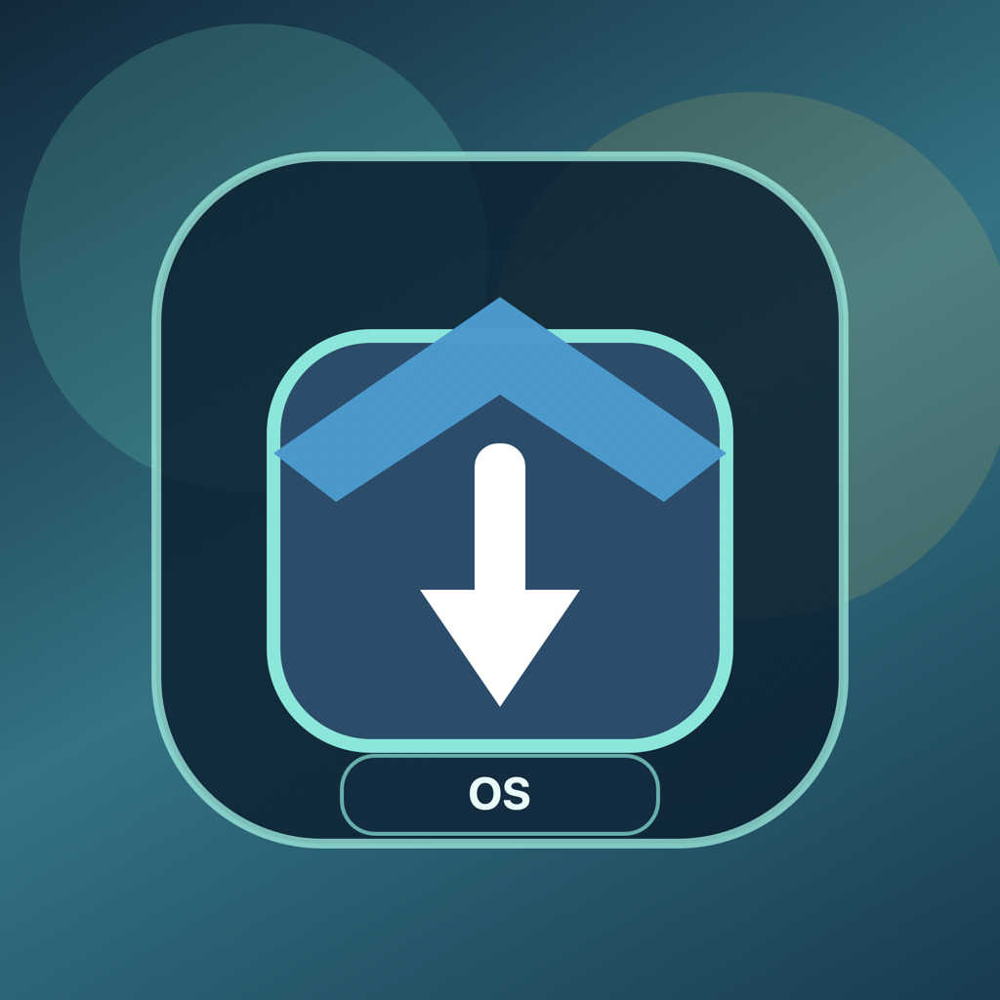

# Open Store

Open Store is an Android-first Flutter app that helps users browse, download, install, open, upgrade, and uninstall apps from one compact place.

## Use Case

Use Open Store to manage all your apps in one place with clear install status, version details, and quick actions.

## Features

- Compact app list with search
- Shows installed version when app is already on device
- Shows only `Download` for apps not installed
- Upgrade detection and guided upgrade action
- Quick actions: Download, Pause, Retry, Redownload, Delete APK, Install, Open, Upgrade, Uninstall
- Integrity verification before install
- App feedback and status tracking
- Activity logs with copy/clear controls
- Theme support (Light, Dark, System) with instant apply
- Check for Open Store updates from Settings
- Version Summary and Safety Details in Settings

## Permissions Required (For Users)

Open Store may require:

- `INTERNET`: To fetch app information and APK files
- `POST_NOTIFICATIONS` (device dependent): To show update notifications
- `Install unknown apps` system setting: To install APK files

Open Store does **not** require camera, microphone, contacts, or location for core app-store usage.

## How To Use

1. Open Open Store.
2. Refresh content and search app from list.
3. Tap `Download` for first-time install.
4. Tap `Install` when download completes.
5. Tap `Open` for installed apps.
6. Tap `Upgrade` only when a newer version is available.
7. Tap `Uninstall` to remove installed apps.
8. Use Feedback for suggestions, issues, or bugs.

## Feedback

Have a suggestion, bug report, or feature request?

You can use the feedback button above to tell us what else should be added.
